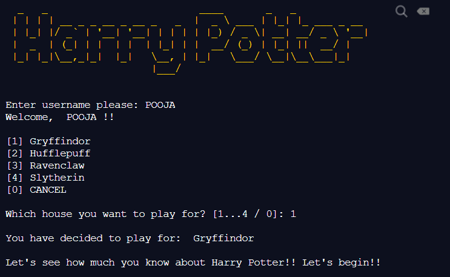

# Harry Potter Quiz

 Neogcamp Assignment 1: Harry Potter Quiz CLI App

Features:
- Choose your house and get your points added to the house.
- Multilevel scores
- Highscores of all players

Play here: [Alohomora](https://repl.it/@hermoine93/Harry-Potter-Quiz#index.js?embed=1&output=1)

Libraries used:
- Chalk
- Figma
- Readline-Sync

<h3>Preview: </h3>

